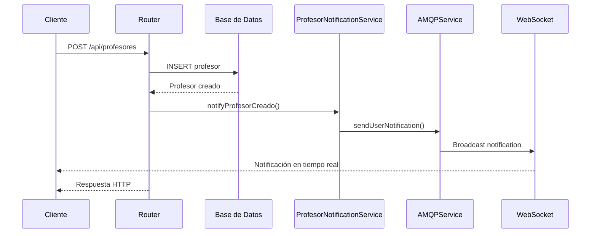
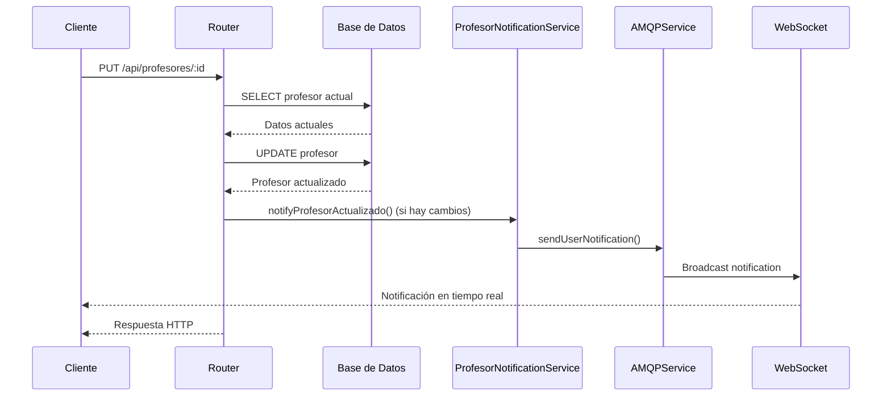
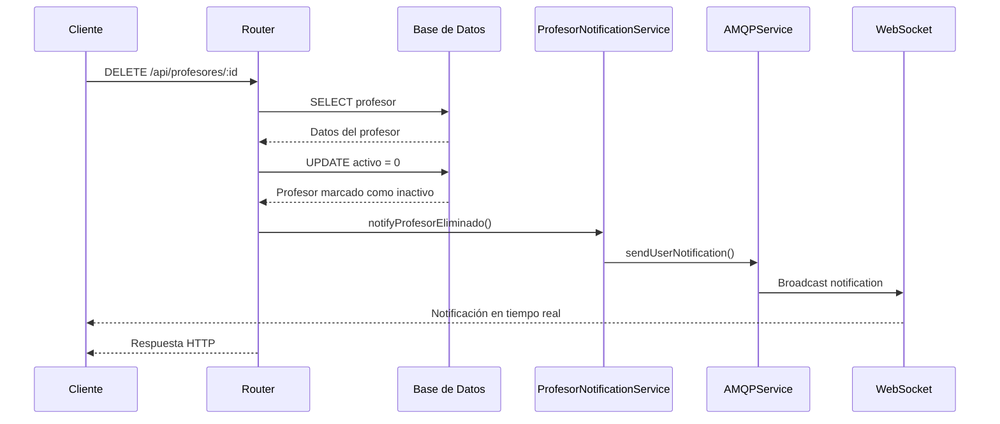

# Integración de Notificaciones con Módulo de Profesores

## Descripción

Este documento describe la integración del sistema de notificaciones en tiempo real con el módulo de profesores del sistema TUPAD Organizador Académico.

## Arquitectura

### Componentes Principales

1. **ProfesorNotificationService** (`backend/services/profesorNotificationService.js`)
   - Servicio específico para notificaciones relacionadas con profesores
   - Maneja diferentes tipos de eventos de profesores
   - Integra con AMQPService para envío de notificaciones

2. **Rutas de Profesores** (`backend/routes/profesores.js`)
   - Rutas modificadas para incluir notificaciones automáticas
   - Eventos: creación, actualización, eliminación de profesores

3. **Frontend** (`frontend/src/controllers/notificaciones.controller.js`)
   - Controlador actualizado con filtros por módulo
   - Iconos y clases CSS específicas para cada tipo de notificación

## Tipos de Notificaciones

### Eventos de Profesores

| Tipo | Descripción | Datos Incluidos |
|------|-------------|-----------------|
| `profesor_creado` | Nuevo profesor registrado | ID, nombre, apellido, email, teléfono, especialidad |
| `profesor_actualizado` | Datos de profesor actualizados | ID, datos actualizados, cambios detectados |
| `profesor_eliminado` | Profesor eliminado del sistema | ID, nombre, apellido, email |

### Eventos de Asignación

| Tipo | Descripción | Datos Incluidos |
|------|-------------|-----------------|
| `materia_asignada` | Materia asignada a profesor | Profesor, materia, horario, día, hora |
| `materia_desasignada` | Materia desasignada de profesor | Profesor, materia, horario, día, hora |
| `horario_asignado` | Horario asignado a profesor | Profesor, materia, horario completo |
| `horario_cambiado` | Horario modificado para profesor | Profesor, materia, horario, cambios |

## Estructura de Datos

### Notificación de Profesor Creado

```javascript
{
    type: 'profesor_creado',
    title: 'Nuevo profesor registrado',
    message: 'Se ha registrado el profesor [Nombre] [Apellido] ([email])',
    data: {
        profesorId: 1,
        profesorNombre: 'Juan Pérez',
        profesorEmail: 'juan.perez@email.com',
        profesorTelefono: '+1234567890',
        profesorEspecialidad: 'Matemáticas',
        action: 'view_profesor'
    }
}
```

### Notificación de Profesor Actualizado

```javascript
{
    type: 'profesor_actualizado',
    title: 'Profesor actualizado',
    message: 'Se han actualizado los datos del profesor [Nombre] [Apellido]',
    data: {
        profesorId: 1,
        profesorNombre: 'Juan Pérez',
        profesorEmail: 'juan.perez@email.com',
        profesorTelefono: '+1234567890',
        profesorEspecialidad: 'Matemáticas',
        cambios: {
            telefono: { anterior: '+1234567890', nuevo: '+0987654321' }
        },
        action: 'view_profesor'
    }
}
```

### Notificación de Materia Asignada

```javascript
{
    type: 'materia_asignada',
    title: 'Materia asignada',
    message: 'Se ha asignado la materia "[Materia]" al profesor [Nombre] [Apellido] - [Día] [Hora]',
    data: {
        profesorId: 1,
        profesorNombre: 'Juan Pérez',
        materiaId: 1,
        materiaNombre: 'Matemáticas I',
        materiaCodigo: 'MAT101',
        horarioId: 1,
        diaSemana: 1,
        diaNombre: 'Lunes',
        horaInicio: '08:00',
        horaFin: '10:00',
        tipoClase: 'Teórica',
        action: 'view_horarios'
    }
}
```

## Flujo de Notificaciones

### 1. Creación de Profesor



### 2. Actualización de Profesor



### 3. Eliminación de Profesor



## Configuración

### Variables de Entorno

```bash
# Configuración de RabbitMQ (AMQP)
RABBITMQ_URL=amqp://localhost:5672
RABBITMQ_USERNAME=guest
RABBITMQ_PASSWORD=guest
RABBITMQ_HOST=localhost
RABBITMQ_PORT=5672
RABBITMQ_VHOST=/

# Configuración de WebSockets
FRONTEND_URL=http://localhost:3000
SOCKET_CORS_ORIGIN=http://localhost:3000

# Configuración de notificaciones
NOTIFICATION_TTL=86400000
NOTIFICATION_MAX_RETRIES=3
```

### Dependencias

```json
{
    "amqplib": "^0.10.3",
    "socket.io": "^4.7.4",
    "uuid": "^9.0.1"
}
```

## Uso en el Frontend

### Filtros por Módulo

```javascript
// Filtrar notificaciones de profesores
notifCtrl.filters.module = 'profesores';

// Obtener tipos de notificaciones para profesores
const tiposProfesores = notifCtrl.getModuleTypes('profesores');
```

### Iconos y Clases CSS

```javascript
// Obtener icono para tipo de notificación
const icono = notifCtrl.getNotificationIcon('profesor_creado'); // 'bi-person-plus'

// Obtener clase CSS para tipo de notificación
const clase = notifCtrl.getNotificationClass('profesor_creado'); // 'text-success'
```

### Tipos de Notificaciones Disponibles

```javascript
const tiposProfesores = [
    'profesor_creado',
    'profesor_actualizado',
    'profesor_eliminado',
    'materia_asignada',
    'materia_desasignada',
    'horario_asignado',
    'horario_cambiado'
];
```

## Manejo de Errores

### Errores de Notificación

```javascript
try {
    await profesorNotificationService.notifyProfesorCreado(profesor, req.user.id);
} catch (notificationError) {
    console.error('Error al enviar notificación en tiempo real:', notificationError);
    // No fallamos la operación principal por un error de notificación
}
```

### Errores de Conexión AMQP

```javascript
// En ProfesorNotificationService
async notifyProfesorCreado(profesor, userId) {
    try {
        const notification = { /* ... */ };
        return await amqpService.sendUserNotification(userId, notification);
    } catch (error) {
        console.error('Error al enviar notificación de profesor creado:', error);
        throw error;
    }
}
```

## Testing

### Pruebas Unitarias

```javascript
describe('ProfesorNotificationService', () => {
    it('should send notification when professor is created', async () => {
        const profesor = {
            id: 1,
            nombre: 'Juan',
            apellido: 'Pérez',
            email: 'juan.perez@email.com'
        };

        const result = await profesorNotificationService.notifyProfesorCreado(profesor, 1);
        expect(result).toBeDefined();
    });
});
```

### Pruebas de Integración

```javascript
describe('Profesores API with Notifications', () => {
    it('should create professor and send notification', async () => {
        const response = await request(app)
            .post('/api/profesores')
            .send({
                nombre: 'Juan',
                apellido: 'Pérez',
                email: 'juan.perez@email.com',
                tipo: 'Titular',
                telefono: '+1234567890'
            })
            .expect(201);

        // Verificar que la notificación se envió
        expect(mockAMQPService.sendUserNotification).toHaveBeenCalled();
    });
});
```

## Monitoreo y Logs

### Logs de Notificaciones

```javascript
// Log de notificación enviada
console.log(`Notificación enviada: profesor_creado para usuario ${userId}`);

// Log de error de notificación
console.error('Error al enviar notificación en tiempo real:', error);
```

### Métricas

- Número de notificaciones enviadas por tipo
- Tiempo de respuesta de las notificaciones
- Tasa de éxito/fallo de envío
- Uso de memoria del servicio de notificaciones

## Consideraciones de Rendimiento

### Optimizaciones

1. **Detección de Cambios**: Solo se envían notificaciones cuando hay cambios reales
2. **Manejo Asíncrono**: Las notificaciones no bloquean las operaciones principales
3. **Reintentos**: Configuración de reintentos para notificaciones fallidas
4. **TTL**: Tiempo de vida configurable para las notificaciones

### Límites

- Máximo 3 reintentos por notificación
- TTL de 24 horas para notificaciones
- Rate limiting en el envío de notificaciones

## Seguridad

### Validaciones

- Verificación de permisos antes de enviar notificaciones
- Validación de datos del profesor antes de crear notificaciones
- Sanitización de mensajes de notificación

### Auditoría

- Log de todas las notificaciones enviadas
- Registro de intentos fallidos
- Trazabilidad de eventos de profesores

## Mantenimiento

### Tareas Programadas

- Limpieza de notificaciones expiradas
- Verificación de conectividad AMQP
- Monitoreo de métricas de rendimiento

### Actualizaciones

- Actualización de tipos de notificaciones
- Modificación de mensajes y formatos
- Agregado de nuevos eventos de profesores